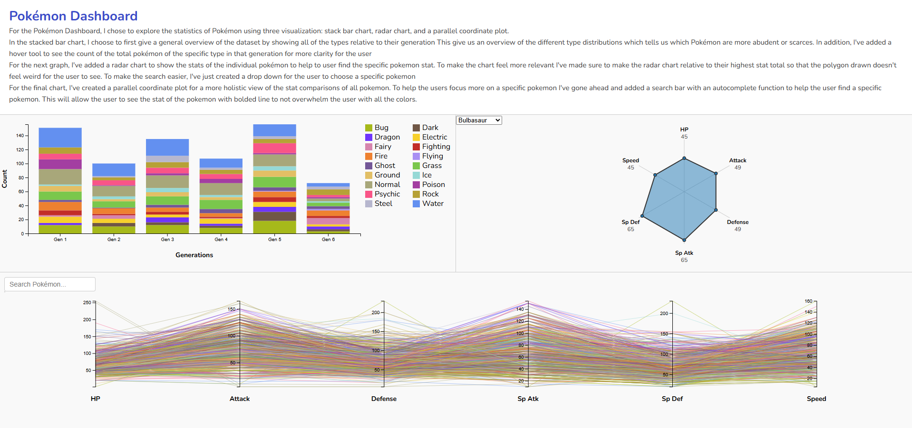
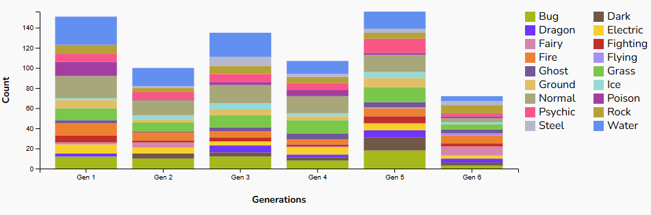
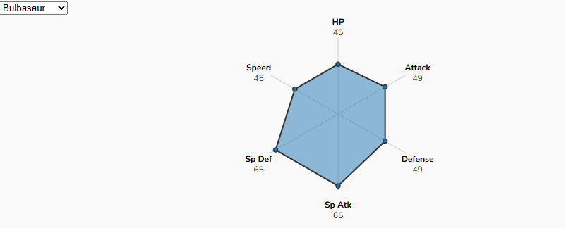
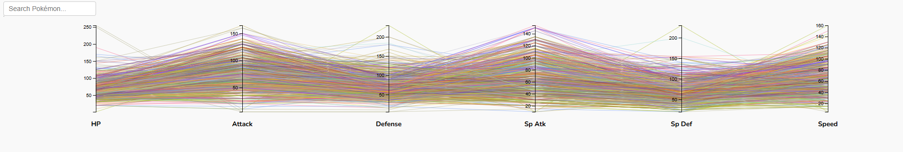

# Pokémon Dashboard

This homework assignment focus on making a data visualization dashboard for exploring Pokémon statistics using D3.js.

## Features

- 📊 **Stacked Bar Chart:** Overview of Pokémon type distribution per generation.
- 🕸 **Radar Chart:** Focus view on an individual Pokémon's battle stats.
- 📈 **Parallel Coordinates Plot:** Advanced comparison across multiple stats, with search and highlight interaction.

## Screenshots

### Dashboard

### Stacked Bar Chart

### Radar Chart (Dynamic per Pokémon)

### Parallel Coordinates Plot with Search

